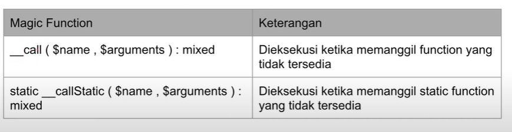

# PHP OOP

## A. PHP OOP (Object Oriented Programming)

A. **OOP** atau Object Oriented Programming adalah sudut pandang bahasa pemograman yang berkonsep atau berorientasi `objek`.

B. Ada beberapa istilah yang perlu dimengerti dalam **OOP**, yaitu: _Object_ dan _Class_.

- Object

  - Adalah data yang berisi _field_/_properties_/_attributes_ dan _method_/_function_/_behavior_.

- Class

  - Adalah _blueprint_, _prototype_, atau _percetakan_ untuk membuat sebuah _object_.

  - `Class` berisikan deklarasi semua _prototype_ dan _function_ yang dimiliki oleh _object_. Dan setipa _object_ selalu dibuat `class`.

  - Dan sebuah `class` bisa membuat _object_ tanpa batas.

### 1. Class

- Di PHP kita bisa membuat `class` dengan menggunakan kata kunci `class`. Dan penamaan dengan format `CamelClass`.

- Kode program

  ```PHP
  class person
  {

  }
  ```

---

### 2. Object

- Pembuatan _object_ di PHP bisa menggunakan kata kunci `new` diikuti dengan nama `class` dan `()`.

- Kode program

  ```PHP
  require_once "data/Person.php";

  $person = new Person();

  var_dump($person);
  ```

---

### 3. Properties

- _field_/_properties_/_attributes_ adalah data yang disipkan kedalam _object_.

- Dan sebelum memasukan data ke _field_ kita harus mendeklarasikan data apa saja yang dimilik _object_ tersebut.

- Pembuatan _field_ bisa menggunakan kata kunci `var`, sama seperti pembuatan _variable_.

- Kode program

  ```PHP
  class person
  {
  var $nama;
  var $address;
  var $country;
  }
  ```

- _field_ yang ada pada _object_ bisa dimanipulasi, dengan menggunakan kata kunci `->` setelah nama _object_ dan diikuti nama _field_ nya.

- Kode program

  ```PHP
  require_once "data/Person.php";

  $person = new Person("Gusti", "Bogor");
  $person->name = "Gusti";
  $person->address = "Bogor";

  var_dump($person);

  //Cara lain
  echo "Name : $person->name" . PHP_EOL;
  echo "Address : $person->address" . PHP_EOL;
  echo "Country : $person->country" . PHP_EOL;

  $person2 = new Person()
  $person2->name = "Elaina";
  $person2->address = "Tokyo";
  $person2->address = "jepang";
  ```

Properties Type Declaration

- Kita bisa membuata `type declaration` dengan menambahkan kata kunci `var` di _properties_.

- Kode Program

  ```PHP
  class person
  {
  var $nama;
  var $address;
  var $country;
  }
  ```

- Kita juga bisa menambahkan default _value_ di _properties_.

- Kode program

  ```PHP
  class person
  {
  var $nama;
  var $address;
  var $country = Indonesia;
  }
  ```

  Nullable Properties

- Mulai dari PHP 7.4 kita bisa mengirimkan data _null_ ke _properties_ atau function arguments.

- Dengan menambahkan kata kunci `?` sebelum `type declaration`.

- Kode program

  ```PHP
  class person
  {
  var ?$address = null;
  }
  ```

---

### 4. Function

- Selain _properties_ kita juga bisa menambahakan `function` ke _object_.

- Untuk mengakses `function` kita bisa menggunakan `->` dan diikuti dengan nama _method_ nya.

- Kode program

  ```PHP
  class person
  {
  var string $nama;
  var ?string $address = null;
  var $country = Indonesia;

  function sayHello(string $nama)
  {
  echo "Hello $nama" . PHP_EOL;
  }
  }
  ```

- Cara memanggilnya

  ```PHP
  require_once "data/Person.php";

  $person = new Person();

  $person->sayHello("Gusti");
  ```

---

### 5. This Keyword

- Kita bisa menggunakan kata kunci `this` untuk mengakses _object_ saat ini.

- Kode program

  ```PHP
  class Person
  {
      var string $name;
      var ?string $address = null;
      var string $country = "Indonesia";

       function sayHello(?string $name)
  {
      if (is_null($name)) {
          echo "Hi, my name is $this->name" . PHP_EOL;
      } else {
          echo "Hi $name, my name is $this->name" . PHP_EOL;
      }
  }
  }
  ```

---

### 6. Constant

- Kita bisa menggunakan kata kunci `conts` untuk membuat constant, mirip dengan _variable_ namun tidak menggunakan `$`.

- Kode program

  ```PHP
  require_once "data/Person.php";

  define("APPLICATION", "Belajar PHP OOP");
  const APP_VERSION = "1.0.0";

  echo APPLICATION . PHP_EOL;
  echo APP_VERSION . PHP_EOL;
  echo Person::AUTHOR . PHP_EOL;
  ```

- Cara mengakses constant

      ```PHP
      class Person
      {
      const AUTHOR = "Gusti Alifiraqsha Akbar";
      }
      ```

  Self Keyword

- Kita bisa mengakses constant dengan menggunakan `namaClass::NAMA_CONSTANT`.

- Dan jika ada didalam _class_ yang sama bisa menggunakan kata kunci `self`.

- Kode program

  ```PHP
  class Person
  {
      function info()
  {
      echo "Author : " . self::AUTHOR . PHP_EOL;
  }
  }
  ```

- Cara mengakses

  ```PHP
  require_once "data/Person.php";

  $kiana->info();
  ```

---

### 7. Constructor

- Didalam _class_ PHP kita juga bisa membuat `constructor`, `constructor` adalah `function` yang akan dipanggil saat pertama kali _object_ dibuat.

- Sama seperti `function`, kita juga bisa memberikan _parameter_ pada `constructor`.

- cara pembuatan `constructor` di PHP harus seperti ini `__construc()`.

- Kode program

  ```PHP
  class Person
  {
      function __construct(string $name, ?string $address)
  {
      $this->name = $name;
      $this->address = $address;
  }
  }
  ```

- Cara mengakses

  ```PHP
  require_once "data/Person.php";

    $gusti = new Person("Gusti", "Bogor");

    var_dump($gusti);
  ```

---

### 8. Destructor

- `Destructor` adalah kebalika dari `constructor`, `destructor` akan dipanggil ketika _object_ dihapus dari memory.

- Cara membuat _function_ `desctructor` bisa menggunakan `nama function __destruc()`.

- Dan khusus `destructor` tidak boleh menambahkan _funtion argument_.

- Kode program

  ```PHP
  class Person
  {
      function __destruct()
  {
      echo "Object person $this->name is destroyed" . PHP_EOL;
  }
  }
  ```

- Cara mengakses

  ```PHP
  require_once "data/Person.php";

  $gusti = new Person("Gusti", "Bogor");
  $kiana = new Person("Kiana", "Depok");

  echo "Program Selesai!" . PHP_EOL;
  ```

---

### 9. Inheritance

- `Inheritance` atau pewarisan adalah fungsi untuk menurunkan sebuah _class_ ke _class_ lainnya.

- Dalam artian kita bisa membuat _class perent_ dan _class child_. Sifat _class parent_ dapat mempunyai banyak _class child_ sementara _class child_ kebalikannya.

- Saat _class parent_ membuat pewarisan otomatis _class child_ akan mempunyai semua _properties_ dan _function_ yang sama seperti _class parent_ nya.

- Untuk menggunakan `inheritance` kita bisa menggunakan kata kunci `extends` lalu diikuti dengan nama _class parent_ nya.

- Kode program

      ```PHP
      class Manager
      {
          function sayHello(string $name): void
      {
          echo "Hi $name, my name is $this->name" . PHP_EOL;
      }
      }

      //dengan menggunakan "extends" artinya class Manager membuat pewarisan pada class VicePresident.
      class VicePresident extends Manager
      {

      }
      ```

  -Cara mengakses

      ```PHP
      require_once "data/Manager.php";

      $manager = new Manager();
      $manager->name = "Elaina";
      $manager->sayHello("Kiana");

      $vp = new VicePresident();
      $vp->name = "Kiana";
      $vp->sayHello("Elaina");
      ```

---

### 10. Namespace

- PHP memiliki fitur `namespace` yang berfungsi menyimpan _class class_ kita didalam `namespace`.

- `Namespace` bisa _nested_, dan jika ingin mengakses _class_ yang terdapat di `namespace` kita perlu menyebutkan nama `namespace`nya.

- Kita bisa menggunakan kata kunci `namespace` untuk membuatnya.

- Dan jika ingin membuat `sub namespace` bisa menggunakan karakter `\` setelah `namespace` sebelumnya.

- Kode program

  ```PHP
    namespace Data\One {
    class Conflict
    {

    }
    }
    namespace Data\Two {
    class Conflict
    {

    }
    }
  ```

- Cara membuat & mengakses `namespace`

  ```PHP
  namespace {

    require_once "data/Conflict.php";
    require_once "data/Helper.php";

    $conflict1 = new Data\One\Conflict();
    $conflict2 = new Data\Two\Conflict();

    echo Helper\APPLICATION . PHP_EOL;

    Helper\helpMe();

    }
  ```

  Global `namespace`

- Global `namespace` adalah `namespace` tanda memiliki nama `namespace`.

---

### 11. Import

- _Import class_ digunakan untuk mengurangi pemanggilan `namespace`, _function_ atau `constant` yang berulang.

- Caranya dengan menggunakan kata kunci `use`.

- Kode program

  ```PHP
  require_once "data/Conflict.php";
  require_once "data/Helper.php";

  use Data\One\Conflict;
  use function Helper\helpMe;
  use const Helper\APPLICATION;

  $conflict1 = new Conflict();
  $conflict2 = new Data\Two\Conflict();

  helpMe();

  echo APPLICATION . PHP_EOL;
  ```

  Alias

- Untuk menghindari menggunakan nama `namespace` yang sama di PHP disediakan fitur `alias`.

- `Alias` memiliki kemampuan untuk membuat nama lain dari _class_, _function_ atau _constant_.

- Dengan menggunakan kata kunci `as` setelah melakukan `use`.

- kode program

      ```PHP
      require_once "data/Conflict.php";
      require_once "data/Helper.php";

      use Data\One\Conflict as Conflict1;
      use Data\Two\Conflict as Conflict2;
      use function Helper\helpMe as help;
      use const Helper\APPLICATION as APP;

      $conflict1 = new Conflict1();
      $conflict2 = new Conflict2();

      help();

      echo APP . PHP_EOL;
      ```

  Group use Declaration

- PHP memiliki fitur `grup use` yang digunakan untuk mengimport beberapa _class_, _function_ dan _constant_ dalam satu perintah `use`.

- Cara menggunakannya dengan mengunakan karakter `{}`.

- Kode program

  ```PHP
  require_once "data/Conflict.php";
  require_once "data/Helper.php";

  use Data\One\{Conflict as Conflict1, Dummy, Sample};
  use function Helper\{helpMe};

  $conflict = new Conflict1();
  $dummy = new Dummy();
  $sample = new Sample();
  ```

---

### 12. Visibility

- _Visibility_ adalah kemampuan _properties_, _function_ dan _constant_ dapat diakses dari mana saja. Dan secara default yang kita buat bersifat _public_ yang artinya dapat diakses dari mana saja.

- Agar turunan dari `class` bisa mengakses kita bisa menambahkan kata kunci `protected`.

- Accses Level
  

- Kode program

  ```PHP
  class Product
  {
    protected string $name;
    protected int $price;

    public function __construct(string $name, int $price)
    {
        $this->name = $name;
        $this->price = $price;
    }

    public function getName(): string
    {
        return $this->name;
    }

    public function getPrice(): int
    {
        return $this->price;
    }
  }

  class ProductDummy extends Product
  {

    public function info()
    {
        echo "Name $this->name" . PHP_EOL;
        echo "Price $this->price" . PHP_EOL;
    }

  }
  ```

- Cara mengakses

  ```PHP
  require_once "data/Product.php";

  $product = new Product("Apple", 20000);

  echo $product->getName() . PHP_EOL;
  echo $product->getPrice() . PHP_EOL;

  $dummy = new ProductDummy("Dummy", 1000);
  $dummy->info();
  ```

---

### 13. Function Overrinding

- Adalah kemampuan mendeklarasikan ulang `function` di `child class` yang sudah ada di `parent class`.

- Kode program

  ```PHP
  class Manager
  {
    var string $name;

    var string $title;

    function sayHello(string $name): void
    {
        echo "Hi $name, my name is Manager $this->name" . PHP_EOL;
    }
  }

  class VicePresident extends Manager
  {

    function sayHello(string $name): void
    {
        echo "Hi $name, my name is VP $this->name" . PHP_EOL;
    }

  }
  ```

- Cara mengakses

  ```PHP
  require_once "data/Manager.php";

  $manager = new Manager();
  $manager->name = "Elaina";
  $manager->sayHello("Kiana");

  $vp = new VicePresident();
  $vp->name = "Gusti";
  $vp->sayHello("Kiana");
  ```

  Parent Keyword

- Untuk mengakses `function` milik `class parent` bisa menggunakan kata kunci `parent`

- Kode program

  ```PHP
  namespace Data;

  class Shape
  {

    public function getCorner()
    {
        return -1;
    }

  }

  class Rectangle extends Shape
  {

    public function getCorner()
    {
        return 4;
    }

    public function getParentCorner()
    {
        return parent::getCorner();
    }

  }
  ```

- Cara mengakses

  ```PHP
  require_once "data/Shape.php";

  use Data\{Shape, Rectangle};

  $shape = new Shape();
  echo $shape->getCorner() . PHP_EOL;

  $rectangle = new Rectangle();
  echo $rectangle->getCorner() . PHP_EOL;
  echo $rectangle->getParentCorner() . PHP_EOL;
  ```

---

### 14. Polymorphism

- Dalam OOP, _polymorphism_ adalah kemampuan sebuah _object_ berubah menjadi bentuk lain.

- _Polymorphism_ erat kaitannya dengan `inheritance`.

- Kode program

  ```PHP
  class Programmer
  {

      public string $name;

      public function __construct(string $name)
      {
          $this->name = $name;
      }

  }

  class BackendProgrammer extends Programmer
  {
  }

  class FrontendProgrammer extends Programmer
  {
  }
  ```

- Cara mengakses

  ```PHP
  require_once "data/Programmer.php";

  $company = new Company();
  $company->programmer = new Programmer("Gusti");
  var_dump($company);

  $company->programmer = new BackendProgrammer("Gusti");
  var_dump($company);

  $company->programmer = new FrontendProgrammer("Gusti");
  var_dump($company);
  ```

  Function Argument Polymorphism

- Kode program

  ```PHP
  function sayHelloProgrammer(Programmer $programmer)
  {
    echo "Hello Programmer $programmer->name" . PHP_EOL;
  }
  ```

- Cara mengakses

  ```PHP
    require_once "data/Programmer.php";

  sayHelloProgrammer(new Programmer("Gusti"));
  sayHelloProgrammer(new BackendProgrammer("Gusti"));
  sayHelloProgrammer(new FrontendProgrammer("Gusti"));
  ```

---

### 15. Type Check & Casts

- Agar aman kita bisa melakukan `type check` dengan menggunakan kata kunci `instanceof` pada `casts`.

- Hasil operator `instanceof` adalah _boolean_, _true_ jika sesuai tipe data, dan _false_ jika tidak sesuai.

- Kode program

  ```PHP
  function sayHelloProgrammer(Programmer $programmer)
  {
    if ($programmer instanceof BackendProgrammer) {
        echo "Hello Backend Programmer $programmer->name" . PHP_EOL;
    } else if ($programmer instanceof FrontendProgrammer) {
        echo "Hello Frontend Programmer $programmer->name" . PHP_EOL;
    } else if ($programmer instanceof Programmer) {
        echo "Hello Programmer $programmer->name" . PHP_EOL;
    }
  }
  ```

---

### 16. Abstract Class

- Saat membuat `class` kita bisa menjadikannya `abstract class`. Yang artinya `class` tersebut hanya bisa diturnkan tanpa bisa dibuat sebagai _object_.

- Kita bisa menggunakan kata kunci `abstract` sebelum `class`.

- kode program

  ```PHP
  namespace Data;

  abstract class Location
  {

      public string $name;

  }

  class City extends Location
  {
  }

  class Province extends Location
  {
  }

  class Country extends Location
  {
  }
  ```

- Cara mengakses

  ```PHP
  require_once "data/Location.php";

  use Data\{Location, City, Province, Country};

  $city = new City();
  $province = new Province();
  $country = new Country();
  ```

---

### 17. Abstract Function

- Selain `abstract class` kita juga bisa membuat `abstract function` didalam `class abstract` tersebut.

- Saat membuat `abstract function` kita tidak boleh membuat _block_ function. Juga tidak boleh _modifier private_.

- Kode program

  ```PHP
  namespace Data;

  abstract class Animal
  {
      public string $name;

      abstract public function run(): void;
  }

  class Cat extends Animal
  {
    public function run(): void
    {
        echo "Cat $this->name is running" . PHP_EOL;
    }
  }

  class Dog extends Animal
  {
    public function run(): void
    {
        echo "Dog $this->name is running" . PHP_EOL;
    }
  }
  ```

- Cara mengakses

  ```PHP
  require_once "data/Animal.php";

  use Data\{Animal, Cat, Dog};

  $cat = new Cat();
  $cat->name = "Shiro";
  $cat->run();

  $dog = new Dog();
  $dog->name = "Kuro";
  $dog->run();
  ```

---

### 18. Getter & Setter

- Di PHP `getter` adalah _function_ yang dibuat untuk mengambil data field.

- Dan `setter` digunakan untuk merubah data field.

1. Encapsulation

   - `Encapsulation` yang artinya data sensitif terhadap sebuah _object_ tersembunyi dari luar.

   - Bertujuan agar menjaga data sebuah _object_ tetap valid.

   - Kita bisa menggunakan `access modifier private`, agar tidak dapat diakses dari luar.

- Getter & Setter Method
  

- Kode program

  ```PHP
  class Category
  {
      private string $name;
      private bool $expensive;

      public function getName(): string
      {
          return $this->name;
      }

      public function setName(string $name): void
      {
        if(trim($name) != ""){
          $this->name = $name;
        }
      }

      public function isExpensive(): bool
      {
          return $this->expensive;
      }

      public function setExpensive(bool $expensive): void
      {
          $this->expensive = $expensive;
      }
  }
  ```

- Cara mengakses

  ```PHP
  require_once "data/Category.php";

  $category = new Category();
  $category->setName("Handphone");
  $category->setExpensive(true);

  $category->setName("              ");
  echo "Name : {$category->getName()}" . PHP_EOL;
  echo "Expensive : {$category->isExpensive()}" . PHP_EOL;
  ```

---

### 19. Interface

- `Interface` disini bukanlah user interface `(ui)`,

- `Interface` mirip seperti `abstract class` yang membedakan di `interface`, semua _method_ otomatis `abstract`.

- `Interface` hanya boleh memiliki `contant`.

- Untuk mewariskan `interface` bisa menggunakan kata kunci `implements`.

- Kode program

  ```PHP
  namsepace Data;

  interface Car
  {
    function drive(): void;

    function getTire(): void;
  }

  class Avanza implements Car, IsMaintenance
  {

    public function drive(): void
    {
        echo "Drive Avanza" . PHP_EOL;
    }

    public function getTire(): int
    {
        return 4;
    }
  }
  ```

- Cara mengakses

  ```PHP
  require_once "data/Car.php";
  use Data\{Avanza};

  $car = new Avanza();
  $car->drive();
  ```

  Interface Inheritance

- Di `interface` sebuah `child class` bisa `implements` lebih dari 1 `interface`.

- Kita bisa menggunakan kata kunci `extends` jika ingin mewarisi `interface` lain.

- Kode program

  ```PHP
  interface HasBrand
  {
      function getBrand(): string;
  }

  interface IsMaintenance
  {
      function isMaintenance(): bool;
  }

  class Avanza implements Car, IsMaintenance
  {

    public function drive(): void
    {
        echo "Drive Avanza" . PHP_EOL;
    }

    public function getTire(): int
    {
        return 4;
    }

    public function getBrand(): string
    {
        return "Toyota";
    }

    public function isMaintenance(): bool
    {
        return false;
    }

  }
  ```

---

### 20. Trait

- Fitur `trait` memungkinkan kita membuat `function` atau `abstract function`.

- Yang membedakan `trait` bisa ditambahkan kedalam _class_ lebih dari satu.

- Kita bisa menggunakan `trait` kata kunci `use`.

- Kode program

  ```PHP
  namespace Data\Traits;

  trait SayGoodBye
  {
      public function goodBye(?string $name): void
      {
          if (is_null($name)) {
              echo "Good bye" . PHP_EOL;
          } else {
              echo "Good bye $name" . PHP_EOL;
          }
      }
  }

  trait SayHello
  {
      public function hello(?string $name): void
      {
          if (is_null($name)) {
              echo "Hello" . PHP_EOL;
          } else {
              echo "Hello $name" . PHP_EOL;
          }
      }
  }

    trait HasName
  {
    public string $name;
  }

  class Person
  {
    use sayGoodBye, sayHello;
  }
  ```

- Cara mengakses

  ```PHP
  require_once "data/SayGoodBye.php";

  use Data\Traits\{Person, SayHello, SayGoodBye};

  $person = new Person();
  $person->goodBye("Kiana");
  $person->hello("Elaina");

  $person->name = "Gusti";
  var_dump($person);
  ```

  Trait Abstract Function

- Kode program

  ```PHP
  trait CanRun
  {
      public abstract function run(): void;
  }

  class Person {

    use SayGoodBye, SayHeloo, HasName, CanRun;

    public function run(): void
    {
      echo "Person $this->name is running" . PHP_EOL;
    }

  }
  ```

- Cara mengakses

  ```PHP
  require_once "data/SayGoodBye.php";

  $person->run();
  ```

---

### 21. Final class

- kata kunci `final` sebelum `class` menandakan bahwa `class` tersebut tidak dapat diwariskan lagi.

- Secara otomatis semua `child class` nya akan _error_.

- Kode program

  ```PHP
  final class SocialMedia
  {
      public string $name;
  }

  //class child nya akan error
  class Facebook extends SocialMedia
  {

  }
  ```

  Final function

- Selain untuk `class` kata kunci `final` juga bisa digunakan untuk `function`.

- Ini sangat cocok untuk mengunci _implementasi_ dari sebuah _method_.

- Kode program

  ```PHP
  class SocialMedia
  {
      public string $name;
  }

  class Facebook extends SocialMedia
  {
      final public function login(string $username, string $password): bool
      {
          return true;
      }
  }
  ```

---

### 22. Anonymous Class

- `Class` tanpa nama sekaligus mendeklarasikan `class` dan meng-instal _object_ nya secara langsung.

- Anonymous `class` juga mendukung `constructor`.

- Kode program

  ```PHP
  interface HelloWorld
  {
      function sayHello(): void;
  }

  $helloWorld = new class("Gusti") implements HelloWorld {

      public string $name;

      //Construct pada anonymous class
      public function __construct(string $name){
          $this->name = $name;
      }

      public function sayHello(): void
      {
          echo "Hello $this->name" . PHP_EOL;
      }
  };
  $helloWorld->sayHello();
  ```

---

### 23. Static Keyword

- Dengan kata kunci `static` yang bisa digunakan untuk membuat _properties_ atau _function_ pada `class`, yang bisa diakses secara langsung tanpa menginstansi `class` terlebih dahulu.

- Cukup menggunakan kata kunci `::` untuk bisa mengakses `static`.

- Kode program

  ```PHP
  namespace Helper;

  class MathHelper
  {
    static public string $name = "MathHelper";
  }
  ```

- Cara mengakses

  ```PHP
  require_once "helper/MathHelper.php";

  use Helper\MathHelper;

  echo MathHelper::$name . PHP_EOL;

  MathHelper::$name = "Gusti Alifiraqsha";
  echo MathHelper::$name . PHP_EOL;
  ```

---

### 24. STD Class

- Adalah `class` kosong bawaan PHP

- `stdClass` digunakan untuk mengkonversi dari tipe data lain menjadi tipe _object_.

- Kode program

  ```PHP
  $array = [
    "firstName" => "Gusti",
    "middleName" => "Alifiarqsha",
    "lastName" => "Akbar"
  ];

  $object = (object)$array;

  var_dump($object);

  echo "First Name $object->firstName" . PHP_EOL;
  echo "Middle Name $object->middleName" . PHP_EOL;
  echo "Last Name $object->lastName" . PHP_EOL;

  $arrayLagi = (array) $object;
  var_dump($arrayLagi);

  require_once "data/Person.php";

  $person = new Person("Gusti", "Bogor");
  var_dump($person);

  $arrayPerson = (array) $person;
  var_dump($arrayPerson);
  ```

---

### 25. Object Iteration

- Dengan menggunakan `foreach` kita bisa melakukan _iterasi_ pada properties sebuah _object_ atau _class_.

- Kita juga bisa menggunakan _iterator_ untuk melakukann _iterasi_ secara manual

- Kode program

  ```PHP
  <?php

  class Data implements IteratorAggregate
  {
      public string $first = "First";
      public string $second = "Second";
      private string $third = "Third";
      protected string $forth = "Forth";

      public function getIterator()
      {
          yield "first" => $this->first; //iterator
          yield "second" => $this->second; //iterator
          yield "third" => $this->third; //iterator
          yield "forth" => $this->forth; //iterator
      }
  }

  $data = new Data();

  foreach ($data as $property => $value) {
      echo "$property : $value" . PHP_EOL;
  }

  ```

---

### 26. Generator

- Digunakan untuk membuat _iterator_ secara otomatis menggunakan `generator`.

- Dengan menggunakan kata kunci `yield`.

  ```PHP
  function getGenap(int $max): Iterator
  {
      $array = [];
      for ($i = 1; $i <= $max; $i++) {
          if ($i % 2 == 0) {
              $array[] = $i;
          }
      }
      return new ArrayIterator($array);
  }

  foreach (getGenap(100) as $value) {
      echo "Genap : $value" . PHP_EOL;
  }
  ```

---

### 27. Object Cloning

- Di PHP mendukung _object_ `cloning`. Dengan menggunaka perintah `clone` kita bisa menduplikasi _object_.

- Kode program

  ```PHP
  class Student
  {
    public string $id;
    public string $name;
    public int $value;
  }
  ```

- Cara mengakses

  ```PHP
  require_once "data/Student.php";

  $student1 = new Student();
  $student1->id = "1";
  $student1->name = "Gusti";
  $student1->value = 100;

  var_dump($student1);

  $student2 = clone $student1;
  var_dump($student2);
  ```

  Clone Function

- perintah `__clone()` digunakan untuk menyeleksi _properties_ mana saja yang ini kita duplikasi.

- Dengan cara membuat function didalam _class_ dengan nama `function__clone()`.

- jika ingin mengapus beberapa _properties_ bisa menghapus di `function__clone()`.

- Kode program

  ```PHP
  class Student
  {
    public string $id;
    public string $name;
    public int $value;
    private string $sample;

     public function __clone()
    {
        unset($this->sample);
    }
  }
  ```

---

### 28. Comparing Object

- Kita bisa membandingkan dua _object_ dengan operator `==` (equals) atau `===` (identity).

- Operator `==` akan membandingkan semua _properties_ yang terdapat pada _object_ tersebut.

- Operator `===` akan membandingkan apakah _object_ identik.

- Kode program

  ```PHP
  require_once "data/Student.php";

  $student1 = new Student();
  $student1->id = "1";
  $student1->name = "Gusti";
  $student1->value = 100;

  $student2 = new Student();
  $student2->id = "1";
  $student2->name = "Gusti";
  $student2->value = 200;

  var_dump($student1 == $student2); //Equals
  var_dump($student1 === $student2); //Identity
  ```

---

### 29. Magic Function

- `Magic Function` adalah _function function_ yang sudah ditentukan kegunaannya di PHP.

- `__toString()` _function_ salah satu `magic function` digunakan untuk representasi _string_ sebuah _object_.

- `__invoke()` _function_ yang akan dieksekusi ketika _object_ yang kita buat dianggap sebagai _function_.

- `__debugInfo()` _function_ sama seperti _function_ `var_dump()`.

- Kode program `__toString()`

  ```PHP
  public function __toString(): string
    {
        return "Student id:$this->id, name:$this->name, value:$this->value";
    }
  ```

- Cara mengakses

  ```PHP
  require_once "data/Student.php";

  $student1 = new Student();
  $student1->id = "1";
  $student1->name = "Gusti";
  $student1->value = 100;

  $string = (string) $student1;
  echo $string . PHP_EOL;
  ```

- Kode program `__invoke()`

  ```PHP
  public function __invoke(...$arguments): void
    {
        $join = join(",", $arguments);
        echo "Invoke student with arguments $join" . PHP_EOL;
    }
  ```

- Cara mengakses

  ```PHP
  require_once "data/Student.php";

  $student1 = new Student();
  $student1->id = "1";
  $student1->name = "Gusti";
  $student1->value = 100;

  $student1(1, "gusti", true, "Alifiraqsha");
  ```

- Kode program `__debugInfo()`

  ```PHP
  public function __debugInfo()
    {
        return [
            "id" => $this->id,
            "name" => $this->name,
            "value" => $this->value,
            "sample" => $this->sample,
            "author" => "Gusti",
            "version" => "1.0.0"
        ];
    }
  ```

- Cara mengakses

  ```PHP
  require_once "data/Student.php";

  $student1 = new Student();
  $student1->id = "1";
  $student1->name = "Gusti";
  $student1->value = 100;
  $student1->setSample("SAMPLE");

  var_dump($student1);
  ```

---

### 30. Overloading

- `Overloading` digunakan untuk membuat _properties_ atau _function_ secara dinamis.

- `Magic Function` untuk properties `overloading`.

  

- Kode program

  ```PHP
  class Zero
  {
      private array $properties = [];

      public function __get($name)
      {
          return $this->properties[$name];
      }

      public function __set($name, $value)
      {
          $this->properties[$name] = $value;
      }

      public function __isset($name): bool
      {
          return isset($this->properties[$name]);
      }

      public function __unset($name)
      {
          unset($this->properties[$name]);
      }

  }

  $zero = new Zero();
  $zero->firstName = "Gusti";
  $zero->middleName = "Alifiraqsha";
  $zero->lastName = "Akbar";

  echo "First Name : $zero->firstName" . PHP_EOL;
  echo "Middle Name : $zero->middleName" . PHP_EOL;
  echo "Last Name : $zero->lastName" . PHP_EOL;
  ```

  Function Overloading

- `Magic Function` untuk `function overloading`.

  

- Kode program

  ```PHP
  public function __call($name, $arguments)
      {
          $join = join(",", $arguments);
          echo "Call function $name with arguments $join". PHP_EOL;
      }

      public static function __callStatic($name, $arguments)
      {
          $join = join(",", $arguments);
          echo "Call static function $name with arguments $join". PHP_EOL;
      }

  $zero->sayHello("Gusti", "Alifiraqsha");
  Zero::sayHello("Gusti", "Alifiraqsha");
  ```

---

### 31. Covariance & Contravariance

- `Convariance` memungkinkan kita meng-override _return_ function yang ada di `parent` dengan _return_ value yang lebih spesifik.

- `Contravariance` memperbolehkan `child class` untuk membuat _function_ argument yang lebih tidak spesifik dibandingkan `parent` nya.

- Kode program `convariance`

  ```PHP
  namespace Data;

  require_once "Animal.php";

  interface AnimalShelter
  {
      function adopt(string $name): Animal;
  }

  class CatShelter implements AnimalShelter
  {
      public function adopt(string $name): Cat
      {
          $cat = new Cat();
          $cat->name = $name;
          return $cat;
      }
  }

  class DogShelter implements AnimalShelter
  {
      public function adopt(string $name): Dog
      {
          $dog = new Dog();
          $dog->name = $name;
          return $dog;
      }
  }
  ```

- Cara mengakses

  ```PHP
  require_once "data/Animal.php";
  require_once "data/AnimalShelter.php";

  $catShelter = new \Data\CatShelter();
  $cat = $catShelter->adopt("Luna");

  $dogShelter = new \Data\DogShelter();
  $dog = $dogShelter->adopt("Doggy");
  ```

- Kode program `Contravariance`

  ```PHP
  namespace Data;

  class Food
  {

  }

  class AnimalFood extends Food
  {

  }
  ```

- Cara mengakses

  ```PHP
  require_once "data/Food.php";
  require_once "data/Animal.php";
  require_once "data/AnimalShelter.php";

  $catShelter = new \Data\CatShelter();
  $cat = $catShelter->adopt("Luna");
  $cat->eat(new \Data\AnimalFood());

  $dogShelter = new \Data\DogShelter();
  $dog = $dogShelter->adopt("Doggy");
  $dog->eat(new \Data\Food());
  ```

---

### 32. DateTime

- Di PHP kita bisa menggunakan `class DateTime` untuk memanipulasi waktu.

- Function `Datetime`
  

- Kode program

  ```PHP
  $dateTime = new DateTime();
  $dateTime->setDate(1990, 1, 20);
  $dateTime->setTime(10, 10, 10, 0);

  var_dump($dateTime);
  ```

---

### 33. Exception

- Di PHP _error_ direpsesentasikan dengan istilah _exception_. Kita juga bisa membuta _class exception_ sendiri atau yang sudah disediakan PHP.

- Jika ingin membuat _exception_ kita harus membuat _class_ yang di _implement interface Throwable_ atau turunannya.

- Kita bisa menggunakan kata kunci `throw` untuk membuat _exception_, diikuti dengan *object*nya.

- Kode program

  ```PHP
  class ValidationException extends Exception {

  }
  ```

- Kode program

  ```PHP
  class LoginRequest
  {
      public ?string $username;
      public ?string $password;
  }
  ```

- Validasi LoginRequest

  ```PHP
  function validateLoginRequest(LoginRequest $request)
  {
      if (!isset($request->username)) {
          throw new ValidationException("Username is null");
      } else if (!isset($request->password)) {
          throw new ValidationException("Password is null");
      } else if (trim($request->username) == "") {
          throw new Exception("Username is empty");
      } else if (trim($request->password) == "") {
          throw new Exception("Password is empty");
      }
  }
  ```

- Cara mengakses

  ```PHP
  require_once "exception/ValidationException.php";
  require_once "data/LoginRequest.php";
  require_once "helper/Validation.php";

  $loginRequest = new LoginRequest();
  $loginRequest->username = "  ";
  $loginRequest->password = "  ";

  try {
      validateLoginRequest($loginRequest);
      echo "VALID" . PHP_EOL;
  } catch (ValidationException | Exception $exception) {
      echo "Error : {$exception->getMessage()}" . PHP_EOL;

      var_dump($exception->getTrace());

      echo $exception->getTraceAsString() . PHP_EOL;
  } finally {
      echo "ERROR ATAU ENGGAK, AKAN DIEKSEKUSI" . PHP_EOL;
  }
  ```

---

### 34. Regular Exspression

- `Regular Exspression` merupakan fitur yang digunakan untuk pencarian _string_ menggunakan pola tertentu.

- Function `Regular Exspression`

  

- Kode program

  ```PHP
  $matches = [];
  $result = preg_match_all("/gus|alif|akb/i", "Gusti Alifiraqsha Akbar", $matches);

  var_dump($result);
  var_dump($matches);
  ```

- Kode program `Regular Ekspression Replace`

  ```PHP
  $result = preg_replace("/anjing|bangsat/i", "***", "dasar lu ANJING dan BANGSAT!");

  var_dump($result);
  ```

- Kode program `Regular Ekspression Split`

  ```PHP
  $result = preg_split("/[\s,-]/", "Gusti Alifiraqsha Akbar,Siswa,Zaman-Now");

  var_dump($result);
  ```

---

### 35. Reflection

- `Reflection` adalah membaca struktur kode pada saat aplikasi sedang berjalan.

- Kode program Validasi menggunakan `reflection`

  ```PHP
  class ValidationUtil
  {
      static function validate(LoginRequest $request)
      {
          if (!isset($request->username)) {
              throw new ValidationException("username is not set");
          } else if (!isset($request->password)) {
              throw new ValidationException("password is not set");
          } else if (is_null($request->username)) {
              throw new ValidationException("username is null");
          } else if (is_null($request->password)) {
              throw new ValidationException("password is null");
          }
      }

      static function validateReflection($request)
      {
          $reflection = new ReflectionClass($request);
          $properties = $reflection->getProperties(ReflectionProperty::IS_PUBLIC);
          foreach ($properties as $property) {
              if (!$property->isInitialized($request)) {
                  throw new ValidationException("$property->name is not set");
              } else if (is_null($property->getValue($request))) {
                  throw new ValidationException("$property->name is null");
              }
          }
      }
  }
  ```

---

## B. Pertanyaan & Catatan Tambahan

- Apa risiko yang terkait dengan validasi menggunakan refleksi dalam PHP, terutama terkait dengan pemeliharaan kode, kestabilan aplikasi, dan keamanan data?

---

## C. Kesimpulan

- Validasi menggunakan refleksi dalam PHP adalah pendekatan yang memanfaatkan kemampuan refleksi dalam bahasa tersebut untuk memeriksa dan memvalidasi properti dalam sebuah objek secara dinamis.
